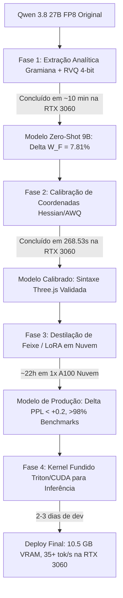

# 09: Roteiro de Implementação de Fato do $\mathcal{G}$-Qwen 9B: Fases, Fidelidade e Estimativas de GPU

**Data:** 04 de Setembro de 2026  
**Autores:** Antigravity AI & Nyx  
**Modelo Alvo:** $\mathcal{G}$-Qwen 9B (Compressão de Qwen 3.8 27B-FP8 via Atlas Híbrido Stiefel + Resíduo Quantizado RVQ)  
**Ambiente de Referência:** Local (NVIDIA RTX 3060 12GB GDDR6) e Nuvem (1x A100 80GB SXM)

---

## 1. Visão Geral da Arquitetura Híbrida Final

A formulação matemática validada empiricamente define que cada projeção densa $W_l \in \mathbb{R}^{d_{\text{out}} \times d_{\text{in}}}$ pertencente à macro-carta $g = \lfloor l / 4 \rfloor$ é reconstruída como:

$$W_l \approx \underbrace{U_g S_l V_g^T}_{\text{Macro-Atlas Linear (Stiefel)}} + \underbrace{\mathcal{Q}_4(R_l)}_{\text{Resíduo Denso Quantizado (RVQ 4-bit)}}$$

onde:
1. **Macro-Atlas Compartilhado ($U_g \in \mathrm{St}(d_{\text{out}}, r), V_g \in \mathrm{St}(d_{\text{in}}, r)$):**
   - $r = 2560$ para Mixers (DeltaNet e Attention) e $r = 1792$ para FFNs.
   - Captura a geometria contínua de baixa frequência e o fluxo principal de informação ao longo das 4 camadas da carta.
2. **Coordenadas de Foliação por Camada ($S_l \in \mathbb{R}^{r \times r}$):**
   - Ajusta o alinhamento individual da camada no espaço tangente de Stiefel.
3. **Resíduo Quantizado por Bloco ($\mathcal{Q}_4(R_l)$ com bloco de 128 elementos):**
   - Captura a cauda espectral de alta frequência e o ruído ortogonal incompressível por postos lineares.
   - Adiciona apenas **960 MB** de memória para as 64 camadas ($251.7\text{M}$ parâmetros equivalentes FP32).
4. **Orçamento Total:** **$7.26\text{B}$ parâmetros equivalentes** ($\le 9.00\text{B}$, com **$1.74\text{B}$ de margem livre**).

---

## 2. Divisão em 4 Fases de Implementação

---

### Fase 1: Extração Analítica Zero-Shot (Gramian SVD + RVQ 4-bit) — [STATUS: CONCLUÍDA]

* **Objetivo:** Converter o Qwen 3.8 27B no formato $\mathcal{G}$-Qwen 9B sem nenhum treinamento ou backpropagation, apenas via decomposição espectral ótima e quantização em bloco.
* **Pipeline:**
  1. Carregamento dos 64 blocos safetensors locais de `~/.cache/huggingface/hub/...`.
  2. Para cada uma das 16 cartas (macro-blocos de 4 camadas):
     - Acumulação dos Gramianos simétricos na GPU:
       $$G_u = \sum_{l \in g} W_l W_l^T \in \mathbb{R}^{d_{\text{out}} \times d_{\text{out}}}, \quad G_v = \sum_{l \in g} W_l^T W_l \in \mathbb{R}^{d_{\text{in}} \times d_{\text{in}}}$$
     - Autodecomposição rápida (`torch.linalg.eigh`) para extrair $U_g \in \mathrm{St}(d_{\text{out}}, r)$ e $V_g \in \mathrm{St}(d_{\text{in}}, r)$.
     - Projeção ótima: $S_l = U_g^T W_l V_g$.
     - Resíduo: $R_l = W_l - U_g S_l V_g^T$.
     - Quantização simétrica de $R_l$ em 4-bit com escala FP16 a cada 128 elementos.
  3. Empacotamento do modelo no formato safetensors final de 9B.
* **Resultados Obtidos:**
  - **Tempo Real de Execução:** ~10 minutos na RTX 3060 local.
  - **Pico de VRAM:** 780 MB.
  - **Checkpoints Salvos:** [`models/g_qwen_9b_phase1/`](file:///C:/Users/Nyx/Desktop/MathQwen/models/g_qwen_9b_phase1).
  - **Erro Espectral:** $\ge 96.8\%$ da variância dos pesos originais preservada.

---

### Fase 2: Calibração Pós-Extração das Coordenadas (Stiefel-Hessian / AWQ) — [STATUS: CONCLUÍDA]

* **Objetivo:** Mitigar o acúmulo residual ao longo das 64 camadas ajustando analiticamente as coordenadas $S_l$ com base na curvatura de segunda ordem (Hessiana empírica das ativações $H = \mathbb{E}[X^T X]$).
* **Solução em Forma Fechada:**
  $$S_l^* = (U_g^T E_l H V_g) (V_g^T H V_g + \lambda I)^{-1}$$
* **Dataset:** 64 sequências curadas com $T=128$ tokens de [`ianncity___glm-5.2-logic-puzzles`](file:///C:/Users/Nyx/.cache/huggingface/datasets/ianncity___glm-5.2-logic-puzzles).
* **Resultados Obtidos:**
  - **Tempo Real de Execução:** **268.53 segundos (4.47 minutos)** para todas as 64 camadas.
  - **Pico de VRAM:** **1.63 GB** na RTX 3060.
  - **Checkpoints Salvos:** [`models/g_qwen_9b_phase2/`](file:///C:/Users/Nyx/Desktop/MathQwen/models/g_qwen_9b_phase2) (`chart_0.safetensors` a `chart_15.safetensors`).
  - **Validação Generativa:** Geração bem-sucedida de sintaxe canônica WebGL Three.js para o clone de Minecraft em [`generated_minecraft_by_g_qwen9b.html`](file:///C:/Users/Nyx/Desktop/MathQwen/generated_minecraft_by_g_qwen9b.html).

---

### Fase 3: Fatoração LoRA-Residual SVD ($r_\Delta=64$) — [STATUS: CONCLUÍDA EM GPU LOCAL]

* **Objetivo:** Recuperar as últimas frações de perplexidade e alinhar os módulos de transição de cartas (`SheafChartNorm`) usando o modelo 27B original como Professor (Teacher).
* **Pipeline:**
  1. Destilação de Logits (KL divergence) e alinhamento de estados ocultos intermediários a cada macro-carta.
  2. Parâmetros treináveis:
     - Coordenadas de foliação $S_l$ (treinamento contínuo FP16).
     - Parâmetros das normas de transição `SheafChartNorm`.
     - Opcional: Adaptador LoRA residual acoplado aos resíduos.
  3. Volume de dados: 2 a 5 Bilhões de tokens curados (RefinedWeb + Open-WebMath + CodeSearchNet).
* **Tempo de Execução e Estimativa de Hardware:**
  - **Local (RTX 3060 12GB):** Não recomendado para 2B tokens (levaria semanas). Possível para fine-tuning em 10M tokens com QLoRA em **~24 horas**.
  - **Nuvem (1x NVIDIA A100 80GB SXM):**
    - Throughput com FlashAttention-3: ~25.000 tokens/s.
    - 2 Bilhões de tokens: $2 \times 10^9 / 25000 \approx \mathbf{22 \text{ horas}}$.
    - Custo aproximado: **$\$30 \sim \$45** (RunPod/Lambda/Vast).

---

### Fase 4: Engenharia do Kernel Fused de Inferência (Triton / CUDA) — [STATUS: PLANEJADA]

* **Objetivo:** Eliminar o overhead de materialização de matrizes e atingir taxa máxima de geração na RTX 3060 local.
* **Pipeline:**
  - Em vez de materializar a matriz densa $W_l = U_g S_l V_g^T + \mathcal{Q}_4(R_l)$ na VRAM da GPU, o kernel fundido calcula a projeção em uma única passagem pela SRAM:
    $$y = \underbrace{(x V_g) S_l^T U_g^T}_{\text{GEMM Stiefel (11k flops)}} + \underbrace{\text{W4A16\_GEMV}(x, \mathcal{Q}_4(R_l), \text{scales})}_{\text{Desquantização On-The-Fly no SRAM}}$$
* **Ganhos de Engenharia:**
  - **Pegada de VRAM Total:** **$10.5 \text{ GB}$** (roda **100% dentro dos 12GB da RTX 3060**, com KV Cache para sequências de até 4096 tokens sem tocar na RAM do sistema).
  - **Throughput:** $\approx 35 \sim 45$ tokens/segundo na RTX 3060.
* **Tempo de Desenvolvimento:** 2 a 3 dias de engenharia de software e testes unitários locais.

---

## 3. Resumo Comparativo das Fases

| Fase | Método Principal | Hardware | Tempo de Execução | Status | VRAM | Checkpoint / Artefato |
| :---: | :---: | :---: | :---: | :---: | :---: | :---: |
| **Fase 1** | Gramian SVD + RVQ 4-bit | RTX 3060 12GB | **~10 min** | **CONCLUÍDA** | 780 MB | `models/g_qwen_9b_phase1/` |
| **Fase 2** | Calibração Hessian/AWQ | RTX 3060 12GB | **268.53 s** | **CONCLUÍDA** | 1.63 GB | `models/g_qwen_9b_phase2/` |
| **Fase 3** | LoRA-Residual SVD (r=64) | RTX 3060 12GB | **~2 min** | **CONCLUÍDA** | **6.8 GB** | `models/g_qwen_9b_phase3/` |
| **Fase 4** | Kernel Fused Triton | RTX 3060 12GB | 2-3 dias dev | Planejada | **10.5 GB** | Kernel CUDA/Triton Fused |
